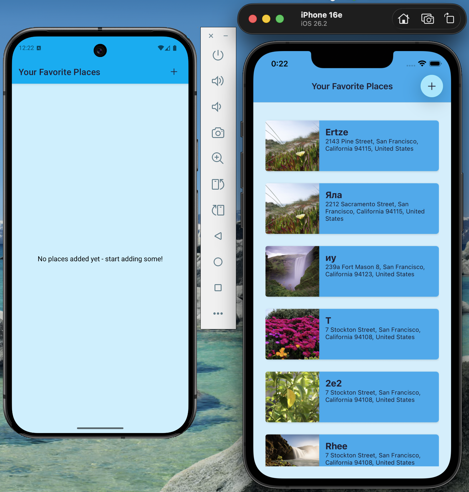
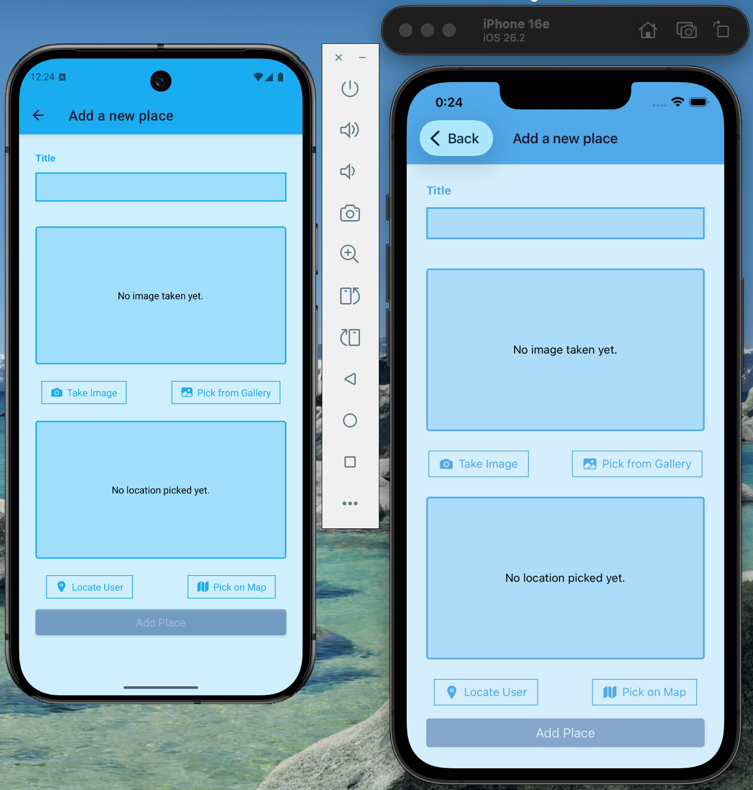
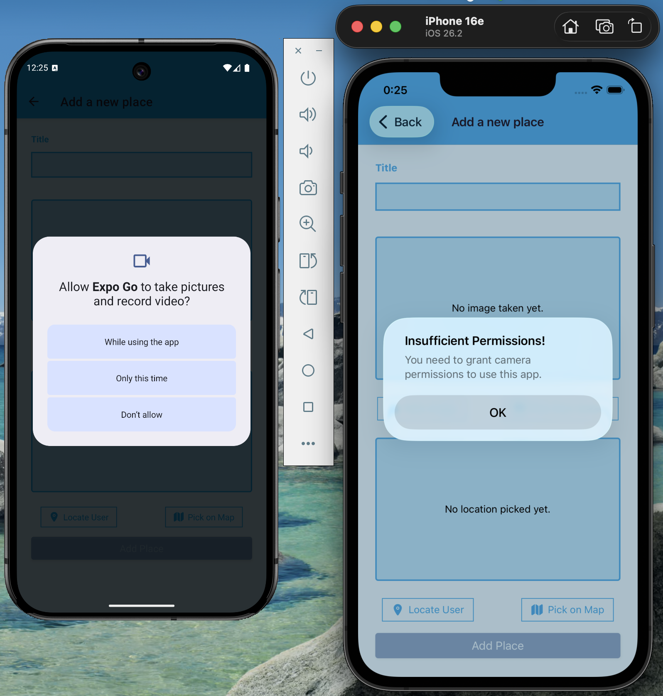
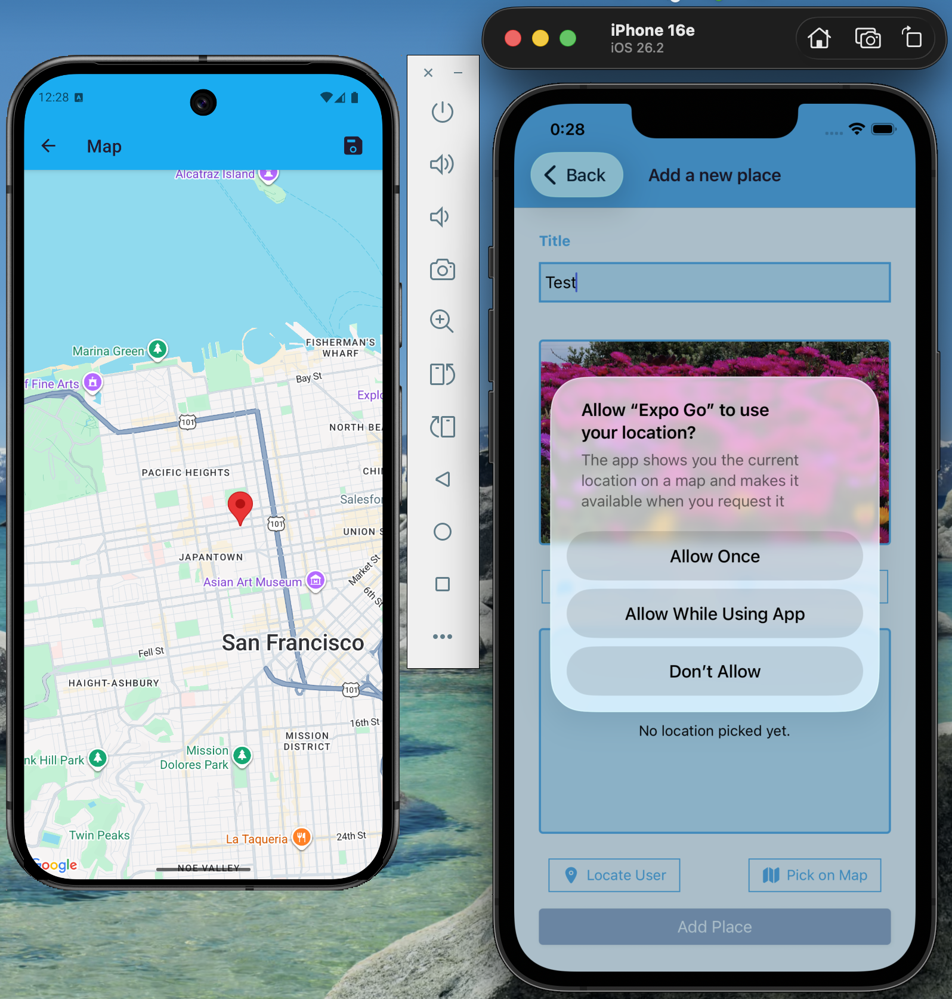
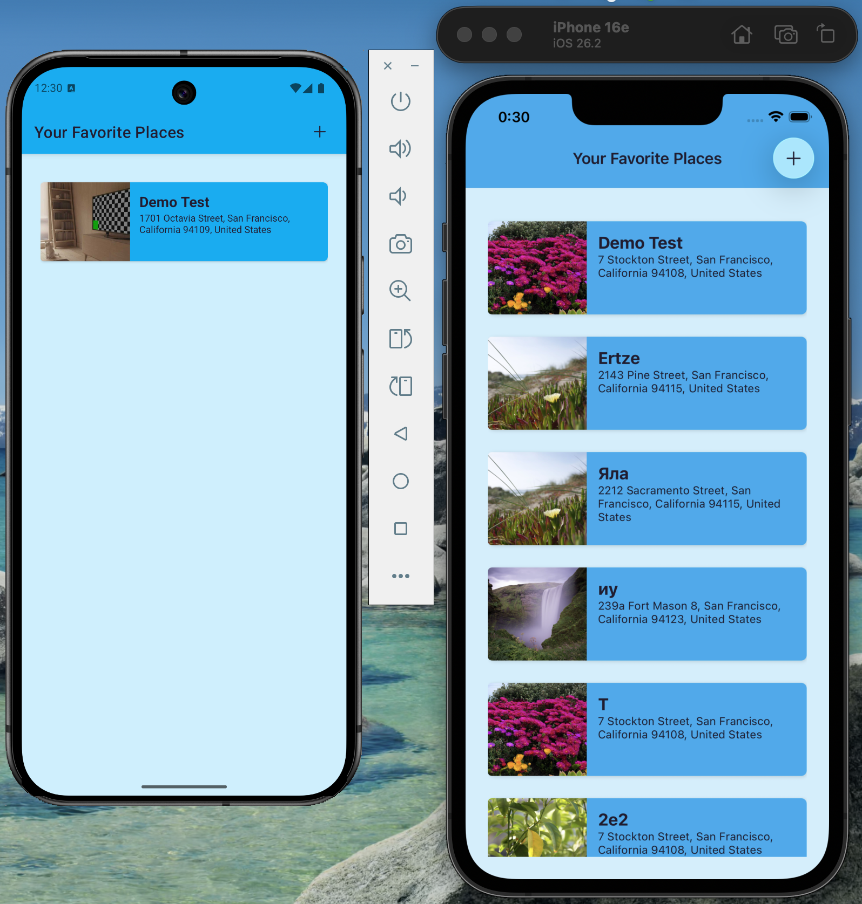
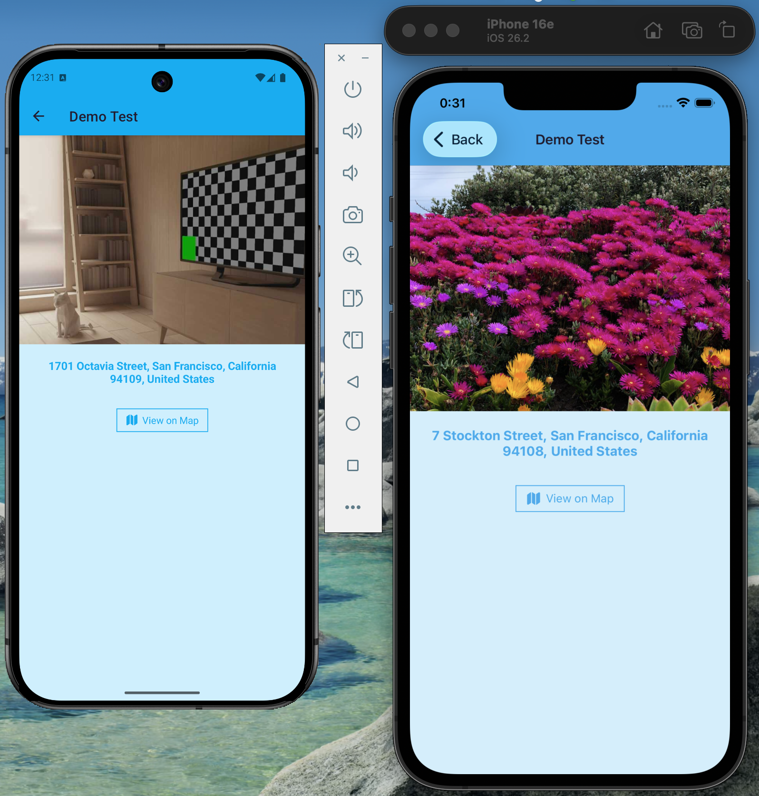
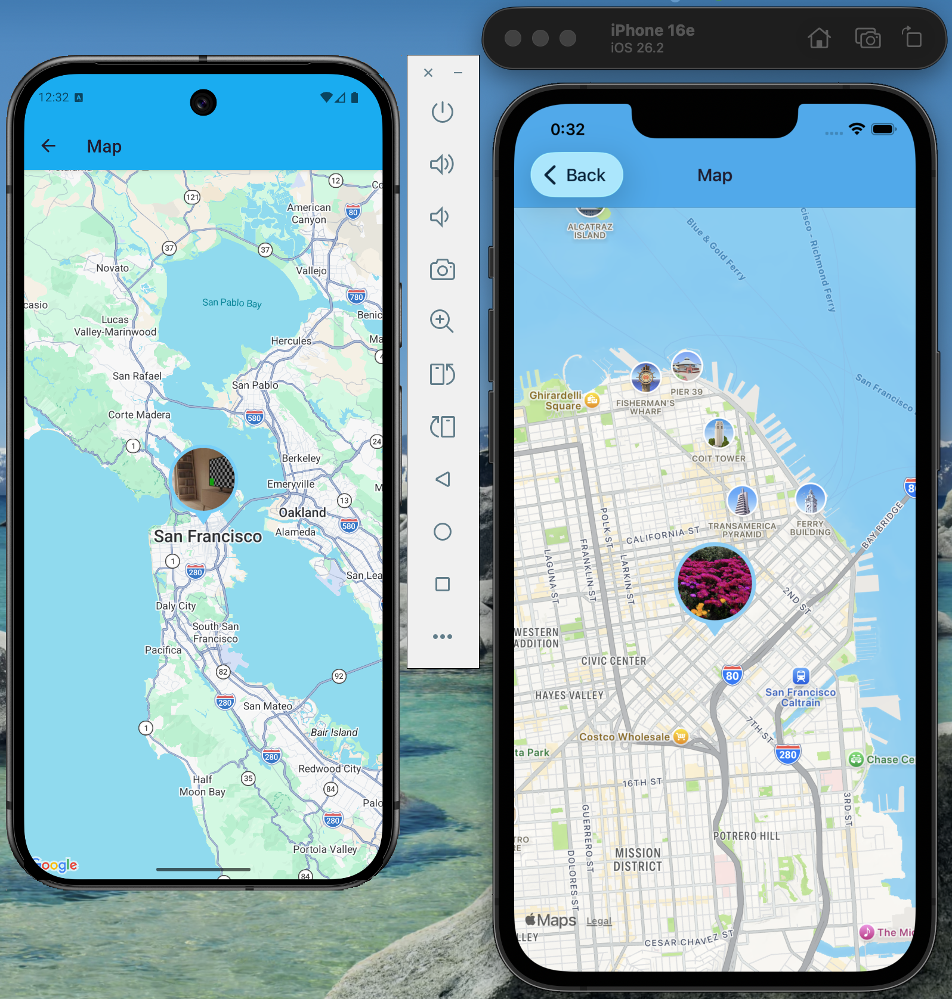
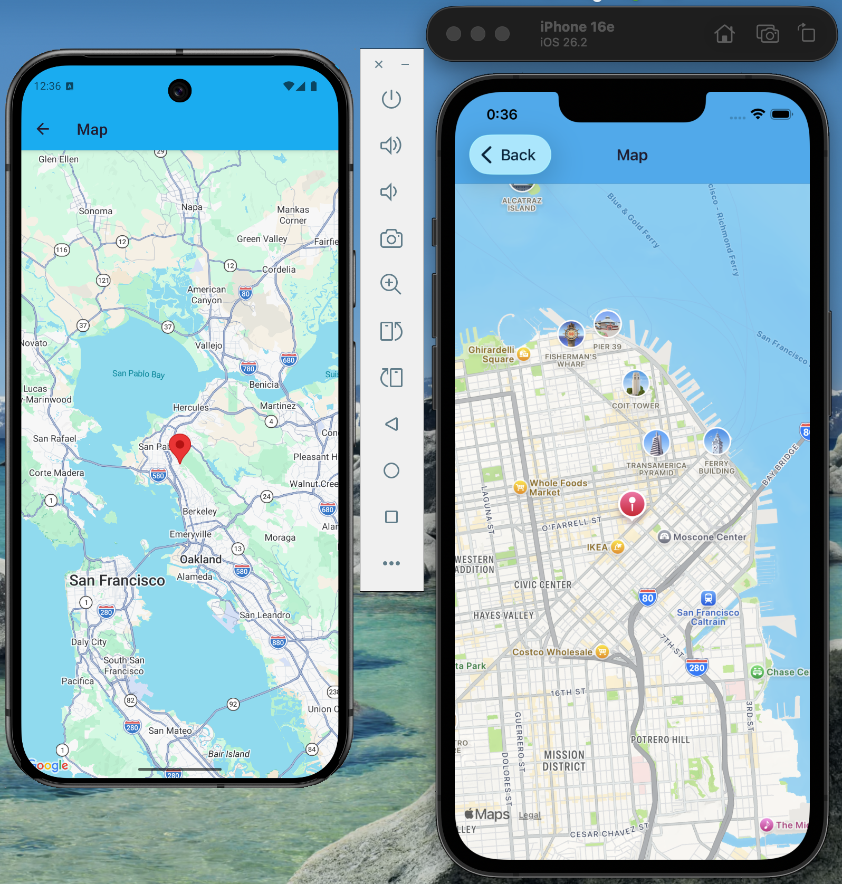

# FavouritePlaces

A React Native app for saving your favourite locations with photos, addresses, and map coordinates.

## Features

- Add places with a title, photo, and location
- Take photos with the camera or pick from gallery (saved to a "FavouritePlaces" album)
- Pick location from map or use current GPS location
- Two map modes: pick mode (select and save location) and view mode (display saved location)
- Reverse geocoding via Mapbox API
- Persistent storage with SQLite
- View place details and see location on map
- Custom photo marker on the map — the place's photo is rendered as a styled pin (circle + pointer)
- Fallback marker support — if custom marker capture fails, a standard map pin is shown

## Tech Stack

- [Expo SDK 54](https://expo.dev) with file-based routing (expo-router)
- TypeScript
- expo-sqlite — local database
- expo-location — GPS
- expo-image-picker & expo-media-library — camera and gallery
- react-native-maps — interactive map
- react-native-view-shot — capturing custom marker view as image
- Mapbox API — map preview and reverse geocoding

## Project Structure

```
app/          # Screens (file-based routes)
components/   # Reusable UI components
  Places/     # Place list and form components
  UI/         # Shared UI (buttons, MarkerGenerator, etc.)
hooks/        # Custom hooks (useMarkerImage)
models/       # Place class
store/        # In-memory state (picked location)
types/        # Shared TypeScript interfaces
util/         # Database and API utilities
```

## Connectivity

- Offline-first: places are stored locally in SQLite
- Internet is required for Mapbox reverse geocoding and static map preview

## Demo Flow

1. Open the app and mention startup DB initialization (SplashScreen waits for SQLite init)

   

2. Tap Add and show the place form (title + image + location)

   

3. Use camera or gallery and mention runtime permissions

   

4. Use Locate User or Pick on Map and mention reverse geocoding via Mapbox

   

5. Save and return to home list (automatic refresh on screen focus)

   

6. Open Place Details and then View on Map

   

7. Highlight custom photo marker generation on the map

   

8. Highlight fallback behavior (standard pin if custom capture fails)

   

## Getting Started

1. Install dependencies

   ```bash
   npm install
   ```

2. Create a `.env` file based on `.env.example` and add your Mapbox token

   ```bash
   cp .env.example .env
   ```

3. Start the app
   ```bash
   npx expo start
   ```
